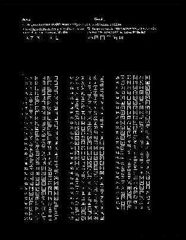

# hayesall-notes

I wanted to explore ways to convert the sequence of boxes into
a value: `A`, `B`, `AB`, etc.

Assuming we can get consistently-sized image crops of 44 x 277 pixels,
this should be pretty straightforward.

`hayesall_exploration.py` so far has a tiny KNN classifier, and a
demonstration for learning from `a-27.jpg` and applying the learned
classifier to crops from `a-3.jpg`. Here's the basic sketch:

```python
class KNN:
    def __init__(self, k=5):
        self.k = k

    def fit(self, X, y):
        self.X = X
        self.y = y

    def predict(self, X):
        heap = []
        for i in range(self.X.shape[0]):
            heappush(heap, (np.linalg.norm(self.X[i] - X), self.y[i]))
        return mode([heappop(heap)[1] for _ in range(self.k)])

clf = KNN(k=1)
clf.fit(X_train, y_train)

clf.predict(X_test[0])
```

Running it currently produces an `edge_image.jpg` file as well, which
is the result of running the built-in edge detection filter from Pillow.
Again, here's a sketch:

```python
from PIL import Image
from PIL import ImageFilter

edge_image = im.filter(ImageFilter.FIND_EDGES)

edge_image.save("edge_image.jpg")
```


