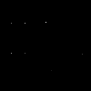

# hayesall-notes
 harsha

I have implemented all the modules up to my knowledge.
All the modules are implemented from scratch using numpy.

Steps followed:
- Image smoothing using gaussian filter.
- Horizantal and Vertical edge detection using Sobel filter(3x3)
- Non-maximum supression.
- Hystereis/Edge linking. 
- Hough Transform line finding.
- Finding the intersection of lines using the lines extracted from above.
- finding the no of pixels in the each box.
- Filtering the box having non zero intensity pixel count greater than threshold.
- Transfering the filtered boxes to output format 


The program will take quite large amount of time like(3,4 minutes).
Need to optimize and refactor the code.

Grade operation is only implemented for shaded boxes not includes handwritten answers.(will update in next commit). As per i observed the grade operation is giving more than 90 % accuracy.

Usage :
```
python3 grade.py "test-images/b-27.jpg"  "output.txt"
```

```
python3 inject.py "test-images/blank_form.jpg" "test-images/a-3_groundtruth.txt" "injected_answers.jpg"
```
```
python3 extract.py "injected_answers.jpg"  "output.txt"
```

sample inject output:


Any suggestions?........
=======
I wanted to explore ways to convert the sequence of boxes into
a value: `A`, `B`, `AB`, etc.

## Handwritten Letter Detection

The assignment instructs:

> It should also output an x on a line for which it believes
> student has written in an answer to the left of the question (as the
> instructions on the answer form
> permit, but your program does not need to recognize which letter was
> written).

For example, if there appears to be a handwritten answer next to
question (6), then it should output an `x` on that line:

```text
1 A
2 A
3 B
4 B
5 C
6 AC x
```

---

### (1) Initial Observations

Alexander (henceforth: I) went through the documents to see what
sort of examples existed.

I observed A, B, C, E "singletons"


I observed combinations of "AB" and "AE"


And I observed things I'll call "*false positives*"
in the `a-27` document. They're interesting because if we
naively assume that anything to the left of a problem is a signal to
regrade, we might incorrectly flag a lot of answers.


<details>
<summary>Coordinates and Documents (for reference)</summary>

```python
from classify.utils import make_crop
from matplotlib.pyplot import imshow
import matplotlib.pyplot as plt
from PIL import Image

im = Image.open("test-images/b-27.jpg")

# Cases in b-27:
# imshow(make_crop(im, 582, 1333))      1
# imshow(make_crop(im, 1010, 1190))     1

# Cases in a-30:
# imshow(make_crop(im, 145, 1951))      1
# imshow(make_crop(im, 1015, 1619))     1
# imshow(make_crop(im, 1015, 1525))     1
# imshow(make_crop(im, 1015, 1476))     1
# imshow(make_crop(im, 1015, 1430))     1
# imshow(make_crop(im, 1015, 1382))     1

# Cases in a-27: (there will be false positives here if we're naive)
# imshow(make_crop(im, 130, 915))       0
# imshow(make_crop(im, 130, 962))       0
# imshow(make_crop(im, 130, 1009))      0
# imshow(make_crop(im, 130, 1152))      0
# imshow(make_crop(im, 130, 1722))      0
# imshow(make_crop(im, 562, 1054))      0
# imshow(make_crop(im, 562, 1242))      0
# imshow(make_crop(im, 562, 1575))      0
# imshow(make_crop(im, 1000, 1430))     0

# Cases in b-13:
# imshow(make_crop(im, 123, 912))       1
# imshow(make_crop(im, 123, 1290))      1
# imshow(make_crop(im, 555, 1478))      1

plt.show()
```

</details>


Therefore, we can make the following observations:

1. We're missing a handwritten "D"
2. We only have examples where "A" and another letter occur together. *Or*: we're missing a huge number of possible combinations
3. If we naively return "True" if there are pixels in a region, we'll produce false positives. *Or*: Not every mark is a letter.

---

### (2) Building a Training Set

It's hard to write a program that recognizes letters, but it's easy
to build a set of examples.

I'll assume that a `(44, 70)` region has sufficient space (I came
to this number based on an earlier exploration of how much space was
needed per "row," and a region of this size was usually sufficient to
contain the handwritten portion). Or: `(3080,)` flat feature vectors.

1. I created 56 positive examples by sampling from the examples above,
   and augmenting this with examples of my own handwriting. This was
   necessary since there were no examples of "D." This training set
   contains all single letters (A, B, C, D, E) and all alphabetical
   two-letter combinations (AB, AC, AD, AE, BC, BD, BE, CD, CE, DE).
2. I created 101 negative examples by randomly sampling regions from
   `a-3.jpg`. This document didn't contain any handwritten letters,
   so by definition any region in this could be a negative example.
   I further augmented this with the "*dots*" from `a-27.jpg`, which
   look like smudges and should *not* be recognized as a letter.


**Left Half**: Positive examples containing handwritten letters.
**Right Half**: Negative examples randomly sampled from `a-3.jpg`,
where no handwritten letters exist. The set contains 56 positives and 101
negatives. The background color is slightly different in the positive set,
but images are binarized before training so this won't affect results.

---

### (3) Training a Model

The high inductive bias of Multinomial Naive Bayes seems like it would
be appropriate here.

Alexander had an implementation he previously wrote for classifying
typed letters in David Crandall's "Artificial Intelligence" class.

The implementation is in `classify/naive_bayes.py`, and the
API looks something like this:

```python
from classify.naive_bayes import NaiveBayesClassifier
import numpy as np

X = np.array([[1, 1, 1], [0, 1, 0], [1, 0, 0]])
y = np.array([1, 1, 0])

clf = NaiveBayesClassifier(alpha=0.0)

clf.fit(X, y)

clf.save("model.pkl")

clf.predict(np.array([[1, 0, 0]]))
```

The `fit_model.py` script can be ran for producing a `model.pkl`.
Here is some pseudocode for how it works:

```julia
pos, neg = load_data()
test_pos, test_neg = remove!(pos, 1), remove!(neg, 1)

X, y = [], []

for image in (pos + neg):

  append!(X, image.data)
  append!(y, image.label)

  for _ in 1:150
    # Create 150 transformations of the input:
    #   - Translations, rotations, Bournoulli-distributed noise
    augmented = augment(image)
    append!(X, augmented.data)
    append!(y, augmented.label)
  end
end

model = NaiveBayesClassifier()

fit!(model, X, y)
save!(model, "model.pkl")
```

Specifically: augmentation takes the original image,
randomly translates it (-5, 5 horizontally and vertically),
randomly rotates it (-15, 15 degrees),
and modifies the input with noise drawn from a Bournoulli distribution
(adding or subtracting pixels).

Below are three examples of how an AE image might be augmented.
**Left**: large rotation, small amount of additive noise.
**Center**: small vertical translation, subtractive noise.
**Right**: small rotation, vertical translation, large additive noise.

  

---

### (4) Evaluating the Model

Running `fit_model.py` also logs some information to the console.

It leaves one positive and one negative example aside for testing,
and also tests on a "weird" case with three letters&mdash;which was
not represented in the training set:


The performance is pretty good.

Basic information gets logged to the console:

```console
Loading data. Make sure `classify/training_data` exists, or unzip it.

	This generates 150 'augmented' images per positive and negative example.

	Found 56 positive examples and 101 negative examples.

	Training data shape: (23405, 3080)

Training a model.

Saving the model to `model.pkl`.

I'll demonstrate performance on three unseen examples:

(True label: 1) Test pos, predicted:    [1]
(            0) Test neg, predicted:    [0]
(            1) Unseen case, predicted: [1]
```

I used some methods from scikit-learn (specifically,
`train_test_split` and `classification_report`, but
these were removed for the submission) to
estimate what performance would be like, which
usually looked something like this:

```console
              precision    recall  f1-score   support

           0       0.93      0.94      0.94       774
           1       0.88      0.87      0.87       397

    accuracy                           0.92      1171
   macro avg       0.91      0.90      0.91      1171
weighted avg       0.92      0.92      0.92      1171
```

These could be *overly-optimistic* though, since these
numbers include performance on augmented images.
Nonetheless, our recall is quite good.

---

## Other Approaches - Harris Corner Detection + Non-Maximum Suppression

(**Alexander worked on this.**)

The `harris/` directory contains notes on this subproblem.

- *In theory*: Answer boxes should have four corners,
  so finding all the corners will probably be helpful.
- *In practice*: There a a lot of things that look like corners
  in these images. It's possible that if the boxes did not contain
  letters (A, B, C, D, E) then this would work better.

### (1) Harris Corner Implementation Notes

This is implemented as a `harris` Python module. The `alpha` and `threshold` parameters are described in Chapter 4 of the
Burger & Burge "Core Algorithms" book, then expanded with
a Java implementation in Appendix B.2, starting on page 294.

The implementation closely mirrors the Java implementation from
the appendix, using similar data structures and names.

```python
from harris.harris import HarrisCornerDetectory
from PIL import Image
import numpy as np

im = np.array(Image.open("docs/book_corners1.png"))

hcd = HarrisCornerDetector(alpha=0.04, threshold=30000)
corners = hcd.find_corners(im)
```

### (2) Harris Corner Demonstrations

The image from the book is in `docs/book_corners1.png`. For the toy example it seems to work well:

<details>
<summary>Code for reproducing this figure</summary>

```python
from harris.harris import HarrisCornerDetector
from PIL import Image
import numpy as np

im = np.array(Image.open("docs/book_corners1.png"))

hcd = HarrisCornerDetector(alpha=0.04, threshold=30000)
corners = hcd.find_corners(im)
out = np.zeros(im.shape)

for corner in corners:
    x, y = corner.coords
    out[x, y] = corner.q

imout = Image.fromarray(out.astype(np.uint8))
imout.save("docs/harris_examples/out.png")
```

</details>

| Input Image | Harris Corner Activations |
| :--- | :--- |
|  |  |

Unfortunately, even after tweaking the `alpha` and `threshold` parameters, there
tend to be a huge number of corners that would be "*false positives*" for our use case. We're
not interested in corners for letters or numbers, so this is seems way too noisy for finding
the rows.

<details>
<summary>Code for reproducing this figure</summary>

```python
from harris.harris import HarrisCornerDetector
from PIL import Image
import numpy as np

im = Image.open("test-images/a-27.jpg")
crop = np.array(im.crop((154, 654, 564, 1148)))

hcd = HarrisCornerDetector(alpha=0.04, threshold=30000)
corners = hcd.find_corners(crop)

out = np.zeros(crop.shape)

for corner in corners:
    x, y = corner.coords
    out[x, y] = corner.q

imout = Image.fromarray(out.astype(np.uint8))
imout.save("docs/harris_examples/a-27-out.png")
```

</details>

| Input Image | Harris Corner Activations |
| :--- | :--- |
|  |  |
