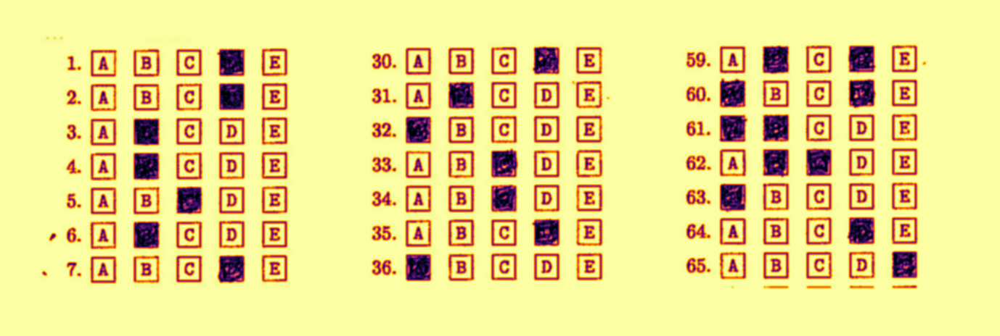
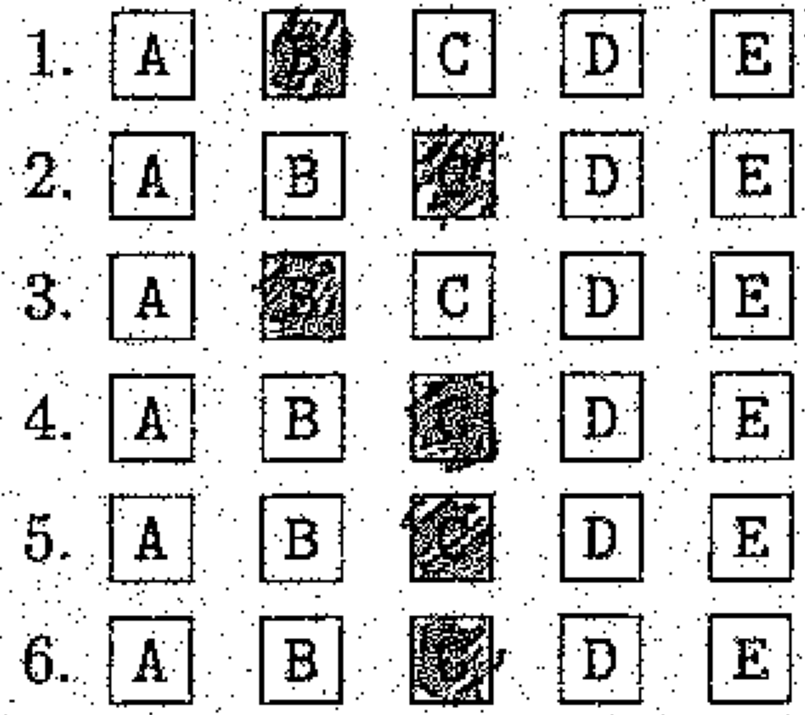
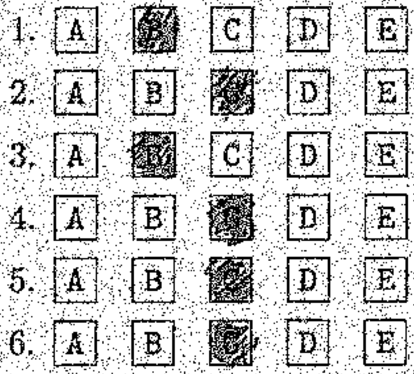
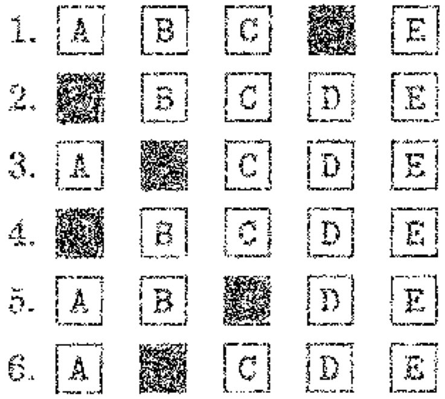
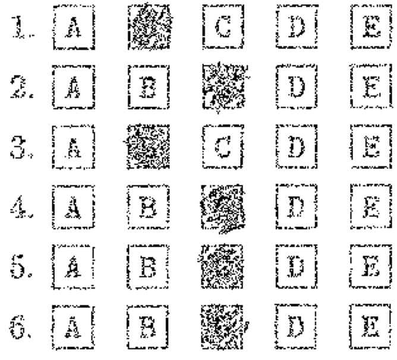

# Computer Vision Grading Assistant

Our group strategy was to "*try multiple approaches in parallel and see which ones worked*."

We concluded that multiple approaches work pretty well. Our "Hough Transform" approach and a "Template Matching" approach tended to produce the same results on the eight benchmark problems. Not everything made it into the final implementation, but we learned quite a bit along the way.

We estimated accuracy by creating `groundtruth` files for all eight images.

1. **Correlation Coefficient Template Matching**

	Accuracy on provided Test Images:

	

	- Time taken to get results is about 2-3 seconds.

2. **Edgedetection using canny and Hough transforms**


	Accuracy on provided Test Images:

	

	- Time taken to get results is about 90-100 seconds.

As two methods are providing the same accuracy numbers but the time taken to extract the answer is quite loger in the edge detection using the hough transform method. So, as default method Correlation Coefficient Template Matching is used. Another option *-m* is used to run the output using the othermethod.

## **Steps of our Approach**:

1. Use template matching + signal processing to find coordinates of rows (see [section for details](https://github.iu.edu/cs-b657-sp2022/hrenkila-hayesall-ajspahi-a1#template-matching-signal-processing-and-interpolation))

	- Line Detection got equivalent results (see [section for details](https://github.iu.edu/cs-b657-sp2022/hrenkila-hayesall-ajspahi-a1#line-detection))
		but was a little slower in practice

2. Pass each coordinate to `RuleBasedClassifier` to perform thresholding on specific regions

	- We originally thought a classifier (see [section for details](https://github.iu.edu/cs-b657-sp2022/hrenkila-hayesall-ajspahi-a1#handwritten-letter-detection))
		would help here.
	- It turned out that simple thresholds based on "how many white pixels occur in a given space" is a really
		good technique here, so the classifier was unecessary.

3. Report results in compliance with instructions

---

### Alexander contributed:

- **Naive Bayes for Handwritten Letter Recognition**
  - Implemented the model learning/inference
  - Created a training set of positive and negative examples
  - Trained a model for detecting whether part of an image contained a handwritten letter
  - After discussions with Harsha, we realized that this performed worse than a simple method based on thresholding the intensity of pixels in a region.
- **Image Data Augmentation Approaches**
  - `classify.data_augmentation.NoiseFactory`: produces random image augmentation to help increase the size of training data
  - Random rotations
  - Random affine transformations
  - Random binomial noise based on XOR and OR pixels to make them more or less intense
- **Rule-Based Classifiers**
  - Threshold-based method for turning shaded boxes into A/B/C/D/E
  - Utilities for cropping images into standard sized regions for: handwriting, problem number, box region.
  - Implemented this as a Python class with an `.identify(number, image)`, where `image` is a cropped region.
- **Harris Corner Detection**
  - `harris.harris.HarrisCornerDetector` object
  - After early experiments and discussion with Harsha, it appeared that this was not very helpful for finding the rows. This *did* get incorporated into the "bar code" finding of the `inject` / `extract` problem.
- **Correlation Coefficient Template Matching**
  - Functions for finding a template image in a bigger image
- **Linear Interpolation of maximum suppression**
- **Injection/extraction**
  - Discussed an early idea with Ajinkya
  - Alexander implemented a method for searching for a "corner" for where the "bar code" would occur, converted Ajinkya's Jupyter notebook into code, and wrote the final `inject.py` and `extract.py` scripts
  - Implemented a simple obfuscation technique to make it more difficult for students to figure out the answers by looking at the bar code

### Harsha contributed:
- Developing OMR extraction method using Canny and Hough transforms.
- Testing accuracy of extraction with injected noise on test-image dataset.
- Readme documentation.
- Injecting the groungtruth answers into the blank omr to visualize the bounding boxes extracted.
- Including the Alexander work(extraction method) in grade.py  as per assignment requirement.
- Thresholding method on no of pixels in bounding boxes for extraction(It is not a robust method).


## Running the Code

The three scripts implement the file-io requirements from the assignment instructions:

```bash
python3 grade.py form.jpg output.txt

	or

python3 grade.py -m edht form.jpg output.txt
```

```bash
python3 inject.py form.jpg answers.txt injected.jpg
```

```bash
python3 extract.py injected.jpg output.txt
```

For a concrete example, here you can insert `b-27_groundtruth.txt` into `b-27.jpg` with `inject.py`:

```bash
python inject.py test-images/b-27.jpg test-images/b-27_groundtruth.txt output.jpg
```

Extract it back out:

```bash
python extract.py output.jpg output.txt
```

And compare the results:

```bash
diff output.txt test-images/b-27_groundtruth.txt
```

Here, we note that there is a difference between the extracted values since we do not insert `x` values into the image, but record them for the ground-truth labels:

```diff
44c44
< 44 ABC
---
> 44 ABC x
70c70
< 70 ABE
---
> 70 ABE x
```

## Other How-To's

### Training a model

The `NaiveBayesClassifier` ended up being too noisy to use in practice, but here's a way to train a model:

```bash
# Unzip the training data
cd classify
unzip training_data.zip
cd ..

# Fit a model
python fit_model.py

# The output model is saved to `model.pkl`. Move it into the `classify/` directory for later use:
mv model.pkl classify/model.pkl
```

# harsha-notes
All the modules are implemented from scratch using numpy, pillow.

OMR Detection Steps followed:

## Edge Detection
- Image smoothing using gaussian filter.


	- The 3X3 gaussian filter is used.
	- There is another option in the smooting of an image usage of Laplacian of Gaussian.
	 	- smooth_image = self.image_smoothing(array,pad,kernal_size,gauss_sigma,is_log=False)
	- 

- Horizantal and Vertical edge detection using Sobel filter(3x3)

	- Computed the G_x and G_y using the Sobel horizantal and vertical filters.
	- The Gradient magnitude GM(image) = \sqrt{G_x^2 + G_y^2} and Gradient Directrion GD(Image) = tan(G_y/G_x) is computed.
	- 


- Non-maximum supression.
	- Supressing the thick edge pixels using non-maximun supression algorithm using the Gradient direction and Gradient magnitude computed above.
		- if current pixel gradent magnitute is greater than the neighbouring pixels in gradient direction then we consider that pixel else we will supress current pixel to zero.
	- 

- Hystereis/Edge linking.
	- Non-maximum supression will not eliminate the noise to get rid of the noise in the edge image.
	- We defined the maximum threshold and minimum threshold for the gradient magnitute. The pixels graeter than max threshold will considered as edge pixels and ignoring less than low threshold pixels. For pixels magnitude in between low and high threshold , if that pixel in connected to high  threshold edge pixel with in the 8 neighbourhood pixels then it is considered as edge pixel else non edge pixel.
	- The High threshold is 0.9 of max gradient magnitude and 0.7 of max gradient magnitude as low threshold. These are fixed by doing different trail and error runs.
	- 

Line Detection
============
- Hough Transform line finding.
	- After the Hysteresis/Edge linking we have the final set of edge image pixels and their corresponding edge gradients.
	- Hough transform find the lines in Polar space instead of Cartesian space.
	- Since we know the gradient diretion of each edge pixel instead of searching for all theta(-180,180) for particular x,y(cartesian) we are only finding the sin curves passing through the  gradient(Taken reference from Computer Vision Algorithms and Applications by Richard Szeliski. page 253, Algorithm 4.2).
	- 
	- Using the above mentioned algorithm filled the accumulator array(Hough Transform).
	-  <b style='color:red'>How to find the number of lines using Accumulator array(Hough Transfom)?</b>.
		-  The goal is to find the lines (58 horizantal and 30 vertical lines) passing through the each box.
		-  Thresholding the number of votes for each row and theta in have to give the lines.
		-  
		-  By experimenting with different different thresholds, observed that due to the letters in boxes E,D,B, the left end portion of these images having a straight line have the no of pixels more than the actual lines so the hough transforms finding lines over there and the thresholding not able to prove the lines which we want as seen in the above image.
		-  Due to that instead of maximum thresholding of votes, tried to take minimum threshold and plotted all the lines.
		-  This minimum thresholding will give all the horizantal and vertical lines, observed that the lines are covering the marking box of options.
		-  
		-   So, for every set of continuous lines, taken start and end line as the lines passing through the bounding boxes of otions in both directions.
		-  
		- To validate the lines got from the above, tried to extract the lines for Blank form and tried to inject the answers from one of the ground_truth.txt and programatically marked the options.
		-  

- Finding the intersection of lines using the lines extracted from above.
	- Intersection of each horizantal and vertical lines found above are stored for extracting the answers.
	- 

- finding the no of pixels in the each box.
	- Observing the out put of the images after hysteris/edge linking, the pixels in options marked are removed.
	- ,
	- This method of finding no of image pixels in each will vary if the boxes are scaled and will not be recommended for robust model.

- Filtering the box having  highest zero intensity pixel count.
- Finding the no of pixels non-zero intensity pixels of every question left to the option A. and question no 1. 59, etc..
- Transfering the filtered boxes to output format
	- 
- Insted of counting no of pixels to mark the answers, cropping the portion of each question options and sending through the developed rule_naive bayes classifier developed by Alex help this edge detection algorithm to get the good results.

The program will take quite large amount of time like(90-100seconds).
Need to optimize and refactor the code.

Usage:

Extracting the answers from OMR
```
python3 grade.py -m edht "test-images/b-27.jpg"  "output.txt"
```

Injecting the answers to blank OMR
```
python3 extra-work/inject.py "test-images/blank_form.jpg" "test-images/a-3_groundtruth.txt" "injected_answers.jpg"
```


=======

# hayesall-notes
I wanted to explore ways to convert the sequence of boxes into
a value: `A`, `B`, `AB`, etc.

## Handwritten Letter Detection

The assignment instructs:

> It should also output an x on a line for which it believes
> student has written in an answer to the left of the question (as the
> instructions on the answer form
> permit, but your program does not need to recognize which letter was
> written).

For example, if there appears to be a handwritten answer next to
question (6), then it should output an `x` on that line:

```text
1 A
2 A
3 B
4 B
5 C
6 AC x
```

---

### (1) Initial Observations

Alexander (henceforth: I) went through the documents to see what
sort of examples existed.

I observed A, B, C, E "singletons"


I observed combinations of "AB" and "AE"


And I observed things I'll call "*false positives*"
in the `a-27` document. They're interesting because if we
naively assume that anything to the left of a problem is a signal to
regrade, we might incorrectly flag a lot of answers.


<details>
<summary>Coordinates and Documents (for reference)</summary>

```python
from classify.utils import make_crop
from matplotlib.pyplot import imshow
import matplotlib.pyplot as plt
from PIL import Image

im = Image.open("test-images/b-27.jpg")

# Cases in b-27:
# imshow(make_crop(im, 582, 1333))      1
# imshow(make_crop(im, 1010, 1190))     1

# Cases in a-30:
# imshow(make_crop(im, 145, 1951))      1
# imshow(make_crop(im, 1015, 1619))     1
# imshow(make_crop(im, 1015, 1525))     1
# imshow(make_crop(im, 1015, 1476))     1
# imshow(make_crop(im, 1015, 1430))     1
# imshow(make_crop(im, 1015, 1382))     1

# Cases in a-27: (there will be false positives here if we're naive)
# imshow(make_crop(im, 130, 915))       0
# imshow(make_crop(im, 130, 962))       0
# imshow(make_crop(im, 130, 1009))      0
# imshow(make_crop(im, 130, 1152))      0
# imshow(make_crop(im, 130, 1722))      0
# imshow(make_crop(im, 562, 1054))      0
# imshow(make_crop(im, 562, 1242))      0
# imshow(make_crop(im, 562, 1575))      0
# imshow(make_crop(im, 1000, 1430))     0

# Cases in b-13:
# imshow(make_crop(im, 123, 912))       1
# imshow(make_crop(im, 123, 1290))      1
# imshow(make_crop(im, 555, 1478))      1

plt.show()
```

</details>


Therefore, we can make the following observations:

1. We're missing a handwritten "D"
2. We only have examples where "A" and another letter occur together. *Or*: we're missing a huge number of possible combinations
3. If we naively return "True" if there are pixels in a region, we'll produce false positives. *Or*: Not every mark is a letter.

---

### (2) Building a Training Set

It's hard to write a program that recognizes letters, but it's easy
to build a set of examples.

I'll assume that a `(44, 70)` region has sufficient space (I came
to this number based on an earlier exploration of how much space was
needed per "row," and a region of this size was usually sufficient to
contain the handwritten portion). Or: `(3080,)` flat feature vectors.

1. I created 56 positive examples by sampling from the examples above,
   and augmenting this with examples of my own handwriting. This was
   necessary since there were no examples of "D." This training set
   contains all single letters (A, B, C, D, E) and all alphabetical
   two-letter combinations (AB, AC, AD, AE, BC, BD, BE, CD, CE, DE).
2. I created 101 negative examples by randomly sampling regions from
   `a-3.jpg`. This document didn't contain any handwritten letters,
   so by definition any region in this could be a negative example.
   I further augmented this with the "*dots*" from `a-27.jpg`, which
   look like smudges and should *not* be recognized as a letter.


**Left Half**: Positive examples containing handwritten letters.
**Right Half**: Negative examples randomly sampled from `a-3.jpg`,
where no handwritten letters exist. The set contains 56 positives and 101
negatives. The background color is slightly different in the positive set,
but images are binarized before training so this won't affect results.

---

### (3) Training a Model

The high inductive bias of Multinomial Naive Bayes seems like it would
be appropriate here.

Alexander had an implementation he previously wrote for classifying
typed letters in David Crandall's "Artificial Intelligence" class.

The implementation is in `classify/naive_bayes.py`, and the
API looks something like this:

```python
from classify.naive_bayes import NaiveBayesClassifier
import numpy as np

X = np.array([[1, 1, 1], [0, 1, 0], [1, 0, 0]])
y = np.array([1, 1, 0])

clf = NaiveBayesClassifier(alpha=0.0)

clf.fit(X, y)

clf.save("model.pkl")

clf.predict(np.array([[1, 0, 0]]))
```

The `fit_model.py` script can be ran for producing a `model.pkl`.
Here is some pseudocode for how it works:

```julia
pos, neg = load_data()
test_pos, test_neg = remove!(pos, 1), remove!(neg, 1)

X, y = [], []

for image in (pos + neg):

  append!(X, image.data)
  append!(y, image.label)

  for _ in 1:150
    # Create 150 transformations of the input:
    #   - Translations, rotations, Bournoulli-distributed noise
    augmented = augment(image)
    append!(X, augmented.data)
    append!(y, augmented.label)
  end
end

model = NaiveBayesClassifier()

fit!(model, X, y)
save!(model, "model.pkl")
```

Specifically: augmentation takes the original image,
randomly translates it (-5, 5 horizontally and vertically),
randomly rotates it (-15, 15 degrees),
and modifies the input with noise drawn from a Bournoulli distribution
(adding or subtracting pixels).

Below are three examples of how an AE image might be augmented.
**Left**: large rotation, small amount of additive noise.
**Center**: small vertical translation, subtractive noise.
**Right**: small rotation, vertical translation, large additive noise.

  

---

### (4) Evaluating the Model

Running `fit_model.py` also logs some information to the console.

It leaves one positive and one negative example aside for testing,
and also tests on a "weird" case with three letters&mdash;which was
not represented in the training set:


The performance is pretty good.

Basic information gets logged to the console:

```console
Loading data. Make sure `classify/training_data` exists, or unzip it.

	This generates 150 'augmented' images per positive and negative example.

	Found 56 positive examples and 101 negative examples.

	Training data shape: (23405, 3080)

Training a model.

Saving the model to `model.pkl`.

I'll demonstrate performance on three unseen examples:

(True label: 1) Test pos, predicted:    [1]
(            0) Test neg, predicted:    [0]
(            1) Unseen case, predicted: [1]
```

I used some methods from scikit-learn (specifically,
`train_test_split` and `classification_report`, but
these were removed for the submission) to
estimate what performance would be like, which
usually looked something like this:

```console
              precision    recall  f1-score   support

           0       0.93      0.94      0.94       774
           1       0.88      0.87      0.87       397

    accuracy                           0.92      1171
   macro avg       0.91      0.90      0.91      1171
weighted avg       0.92      0.92      0.92      1171
```

These could be *overly-optimistic* though, since these
numbers include performance on augmented images.
Nonetheless, our recall is quite good.

---

## Template Matching, Signal Processing, and Interpolation

**Problem**: We needed a robust way to find the "rows" in an image.

**Solution**: One way to find rows is through applying a **correlation coefficient template matching**
approach, tuning a threshold to find areas with high correlation, finding the top-three peaks to
signal where the columns are, then linearly interpolating in case some rows were thrown out.

---

### (1) Template Matching with three kernels

We'll apply the **Correlation Coefficient Template Matching** approach
where we estimate the correlation between a "template" image (R) and
a "search" image (I).

> Wilhelm Burger and Mark J. Burge. "*Principles of Digital Image
> Processing: Core Algorithms*,"
> (Chapter 11) *Comparing Images*, pp. 258-264.

**Correlation Coefficient Template Matching** has two parameters:

- *The Template* (R): A template to search (I) for
- *Correlation Threshold*: Return matches greater than some threshold (e.g. 0.5-0.9)

---

#### (1.1) The Template

"*Periods next to a number*" perfectly correlate with the regions of the image we want.

We'll try three approaches: K1, K2, K3 (there's nothing special about the ordering, it's just the order I tried them in).

- `K1`: A period with part of the "A" box
- `K2`: A period
- `K3`: A period with **all** 1-pixel thickness portion of the "A" box

| K1 | K2 | K3 |
| :---: | :---: | :---: |
|  |  |  |

Directly looking for these in a noisy image did not seem likely to be robust, so I applied a Gaussian blur filter (`template_matching.filters.blur_filter`)
to the kernels:

| K1 + Blur | K2 + Blur | K3 + Blur |
| :---: | :---: | :---: |
|  |  |  |

| Original Image | Blurred |
| :-----: | :-----: |
|  |  |

For example, here is the correlation between our blurred input image
and the blurred `K3` kernel. Areas with high intensity have high correlation
with the kernel:


---

#### (1.2) The Correlation Threshold + Signal Processing

These three figures show (**Top**) a heatmap for K1, K2, and K3 as the threshold increases.
(**Bottom**) The 1D signal sums each column and convolves the result with a
Gaussian filter: estimating the "strength" of each column. As the threshold increases,
the signal tends to converge toward having 3-peaks, corresponding to the three columns
where periods and boxes occur:

| Kernel | Effect of Varying the Threshold |
| :----- | :----: |
| `K1` |  |
| `K2` |  |
| `K3` |  |

- **Takeaway 1**: All three templates seem reasonable after tuning the correlation threshold and applying non-maximum suppression.
- **Takeaway 2**: We can ignore everything outside the strongest peaks in the correlation matrix.

In practice, `K3` appears to have the widest range of thresholds (0.65 - 0.9) and seems fairly resistent to finding
false positives. This might be because a "*period and the left pixels of the A box* are one of the most discriminative
features for identifying rows.

---

### (2) Interpolation to Resist Noisy Inputs

**Problem**: Imagine that noise in the input image causes our template
matching approach to miss a row.

Imagine the image still contains all the filled in "answers," but
some periods and boxes are missing:


The rows should be relatively evenly spaced horizontally and vertically, so we can interpolate for where
the rows are likely to be, even without perfect information.

(**Top**): Template matching on the "corrupted" example.
(**Middle**): 1D signal estimating strength of columns, described earlier.
(**Bottom**): Noise removal + linear interpolation for missing examples.


---

### (3) Robustness to Translation, Rotation, Noise

- **Translation**: Good between (-100, 100) pixels in both x/y directions.
- **Rotation**: I was testing with PIL's `Image.rotate` method, and
  was amazed how even small rotations (-0.005, 0.005) could cause
  problems. It appears that problems arise from the non-maximum
  suppression step: rotations seem to cause multiple local maxima
  within small regions.
- **OR Noise**: Randomly sample binomial noise, and turn pixels white
  with `p` probability. Good up to `0.3`, but more pronounced for images
  that are low-contrast to begin with (e.g. `a-3.jpg`)
- **XOR Noise** Randomly sample binomial noise, and XOR a pixel with `p`
  probability (white -> black, black -> white). Even small amounts of
  XOR noise (e.g. 0.01) cause issues.

Some examples for applying noise to images are below.
`OR` noise seems fairly mild as long as we don't randomly turn more than
~30% of pixels white (most of the pixels are white already, so it's unlikely
to cause major problems after blurring). `XOR` noise is incredibly damaging,
if we randomly invert ~1% of pixels, it grows difficult to determine where
the templates are.

| Noise Type | Low Noise | High Noise |
| :---- | :---: | :---: |
| XOR |  |  |
| OR |  |  |

---

## Other Approaches - Harris Corner Detection + Non-Maximum Suppression

(**Alexander worked on this.**)

The `harris/` directory contains notes on this subproblem.

- *In theory*: Answer boxes should have four corners,
  so finding all the corners will probably be helpful.
- *In practice*: There a a lot of things that look like corners
  in these images. It's possible that if the boxes did not contain
  letters (A, B, C, D, E) then this would work better.

### (1) Harris Corner Implementation Notes

This is implemented as a `harris` Python module. The `alpha` and `threshold` parameters are described in Chapter 4 of the
Burger & Burge "Core Algorithms" book, then expanded with
a Java implementation in Appendix B.2, starting on page 294.

The implementation closely mirrors the Java implementation from
the appendix, using similar data structures and names.

```python
from harris.harris import HarrisCornerDetectory
from PIL import Image
import numpy as np

im = np.array(Image.open("docs/book_corners1.png"))

hcd = HarrisCornerDetector(alpha=0.04, threshold=30000)
corners = hcd.find_corners(im)
```

### (2) Harris Corner Demonstrations

The image from the book is in `docs/book_corners1.png`. For the toy example it seems to work well:

<details>
<summary>Code for reproducing this figure</summary>

```python
from harris.harris import HarrisCornerDetector
from PIL import Image
import numpy as np

im = np.array(Image.open("docs/book_corners1.png"))

hcd = HarrisCornerDetector(alpha=0.04, threshold=30000)
corners = hcd.find_corners(im)
out = np.zeros(im.shape)

for corner in corners:
    x, y = corner.coords
    out[x, y] = corner.q

imout = Image.fromarray(out.astype(np.uint8))
imout.save("docs/harris_examples/out.png")
```

</details>

| Input Image | Harris Corner Activations |
| :--- | :--- |
|  |  |

Unfortunately, even after tweaking the `alpha` and `threshold` parameters, there
tend to be a huge number of corners that would be "*false positives*" for our use case. We're
not interested in corners for letters or numbers, so this is seems way too noisy for finding
the rows.

<details>
<summary>Code for reproducing this figure</summary>

```python
from harris.harris import HarrisCornerDetector
from PIL import Image
import numpy as np

im = Image.open("test-images/a-27.jpg")
crop = np.array(im.crop((154, 654, 564, 1148)))

hcd = HarrisCornerDetector(alpha=0.04, threshold=30000)
corners = hcd.find_corners(crop)

out = np.zeros(crop.shape)

for corner in corners:
    x, y = corner.coords
    out[x, y] = corner.q

imout = Image.fromarray(out.astype(np.uint8))
imout.save("docs/harris_examples/a-27-out.png")
```

</details>

| Input Image | Harris Corner Activations |
| :--- | :--- |
|  |  |

# Injection and Extraction Part (Ajinkya and Alexander)

For the injection part we take the ground truth text file and insert the answers on a blank form using an encrypted bar code. For the injection part we create a 85 X 5 matrix where row corresponds to the question number and column corresponds to the option marked per question. We then go on to mark pixels in this array using a thresholding strategy. In order to ensure that the bar code is robust to changes in the pixel shifting, we use Haris corner detection to first get coordinates of the top left hand corner of the bar code and then we move on to extract the array to decode it. Inorder to ensure that students are not able to recognize patterns in the bar code, we randomly assign a roll value using a randomizer to roll the entire matrix so that the starting and the end point of the matrix are shifted thereby masking it evidently from students. To make it robust to pixel shifting we have blown up the size of each window from 1 X 1 to 4 X 4 inorder to deal with noise introduced by scanning the printed image. Thus we know 340 X 20 matrix which will also be robust to slanted barcode boxes as we take the mean for every window.

For the decoding part we reverse the entire process and the secret rolling number for the array will be used to further get a list of answers from the barcode to create the text file.

The bar code is added to the center region of an image:


This is loosely based on QR codes. The pattern in the top-left corner produces a high corner activation when passed to a Harris Corner Detector:

| Original Image | Harris Corner Activations |
| :---: | :---: |
|  |  |
